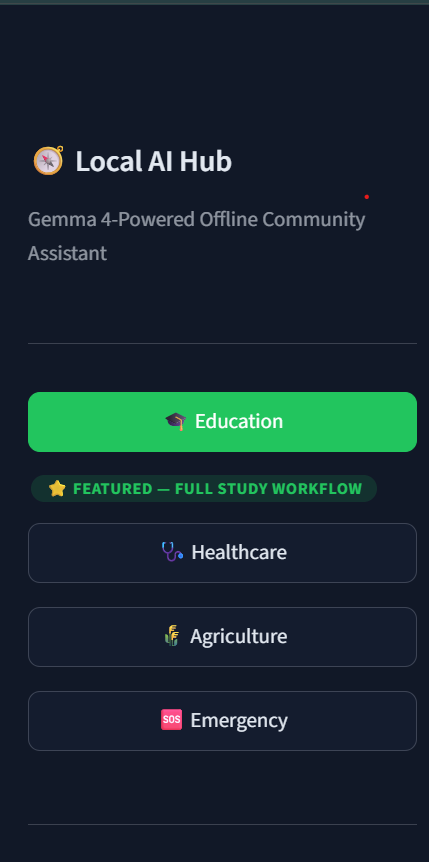
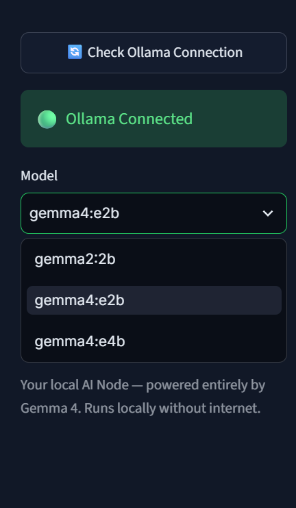
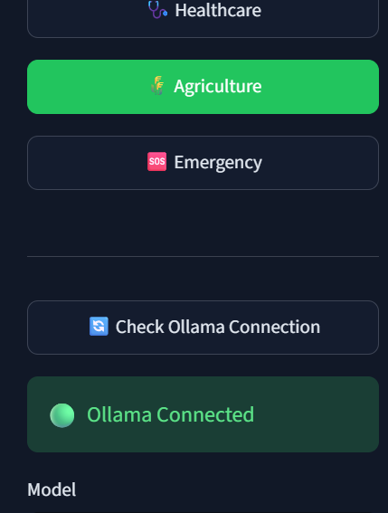
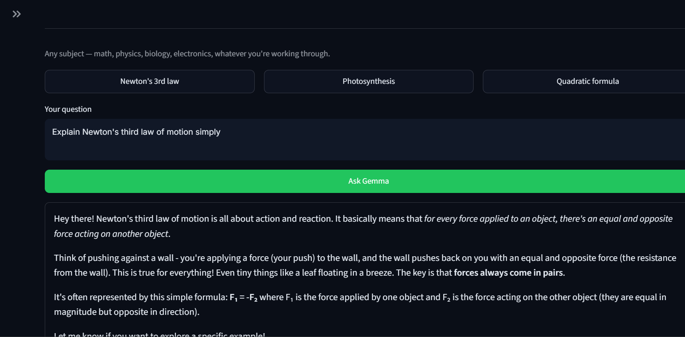
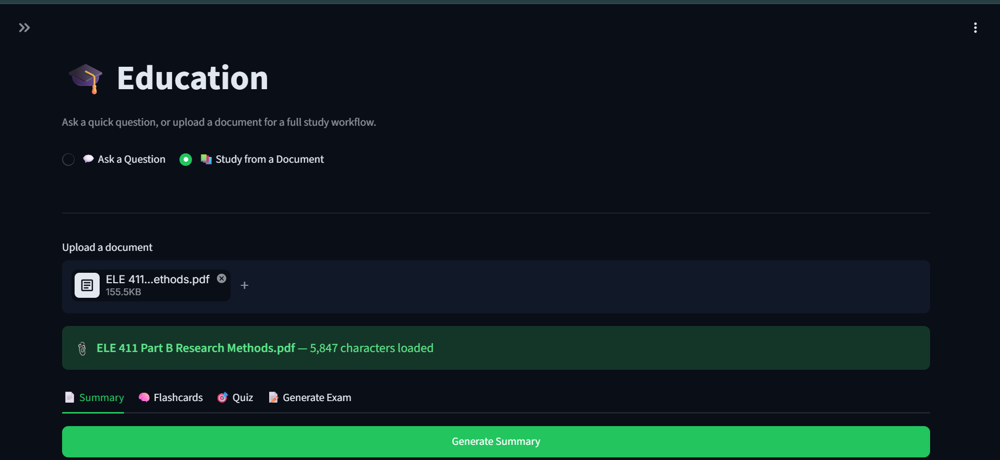
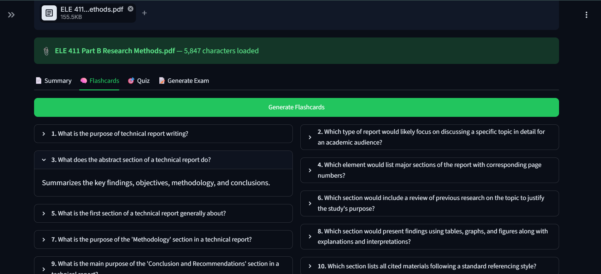
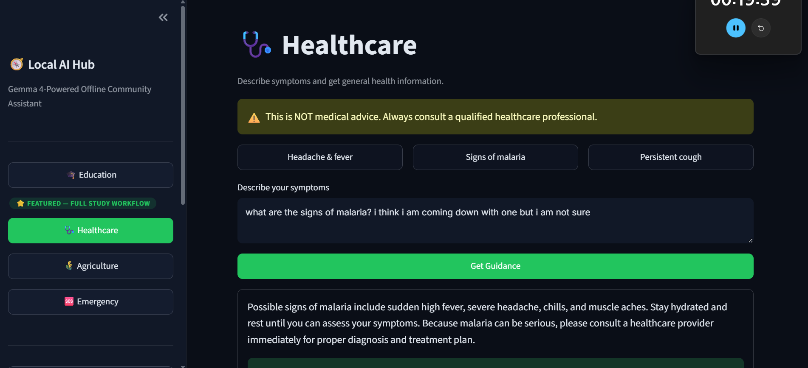
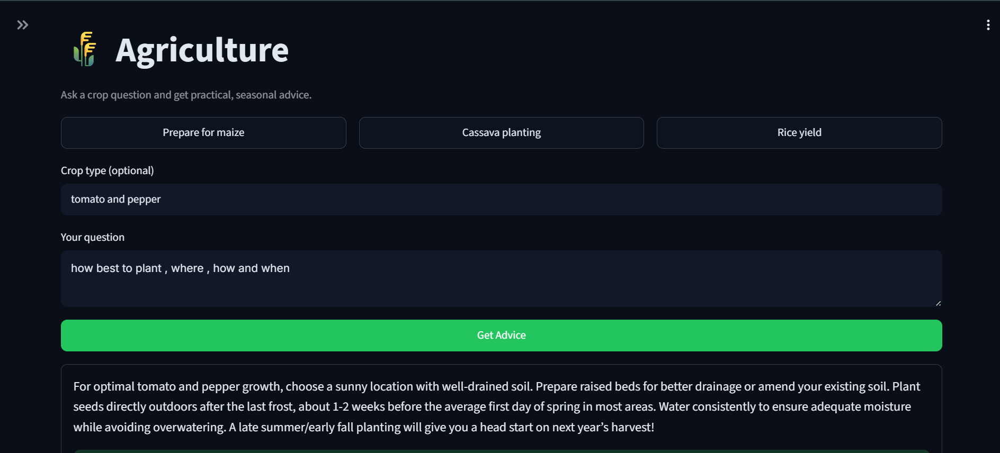
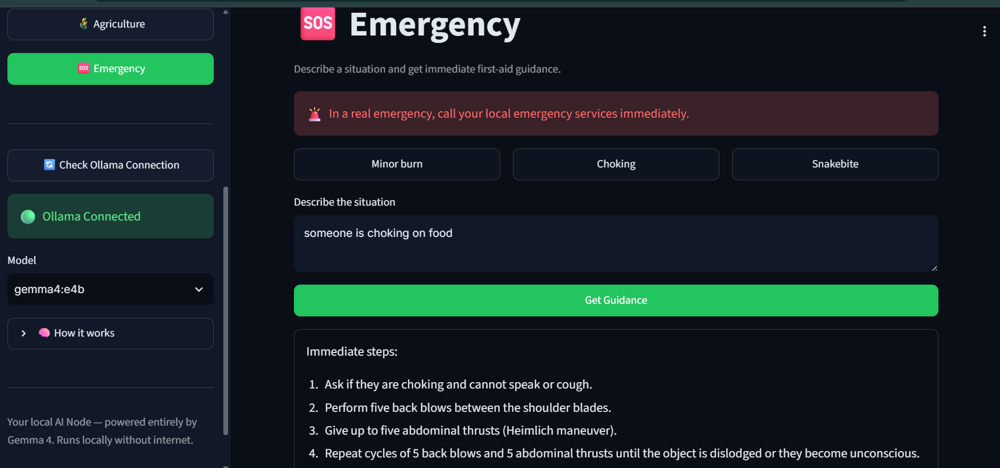
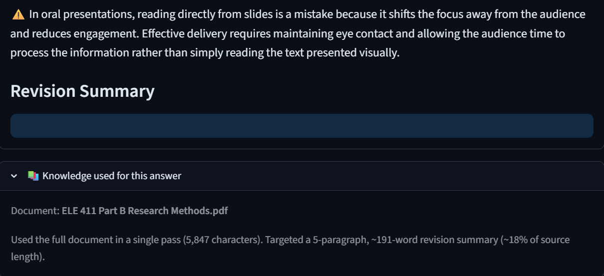

<div align="center">

# 🧭 Local AI Hub

### Gemma 4-Powered Offline Community Assistant

**Education. Healthcare. Agriculture. Emergency.**
**One assistant, four domains, zero internet required.**

</div>

---

## Overview

Local AI Hub is a single desktop-grade web app that puts four AI assistants
behind one sidebar — Education, Healthcare, Agriculture, and Emergency — all
powered by a Gemma model running entirely on your own machine through
[Ollama](https://ollama.com). No cloud API key. No internet connection after
setup. No data ever leaves the device it's running on.

Upload a document once and get a full study workflow out of it — summary,
flashcards, quiz, exam — or just ask a direct question in any of the four
domains and get a straight, streamed answer back.

---

## The Problem

Most communities that would benefit most from AI assistance are the ones
least likely to have reliable internet access: rural schools, clinics with
patchy connectivity, farms far from broadband, and emergency situations
where a network simply isn't available when it matters most. Meanwhile,
almost every AI product assumes a live connection to a cloud API as a given.

That assumption locks out exactly the people who'd benefit most.

## Why Edge AI

Running the model **on the device**, instead of calling out to a cloud API,
changes what's possible:

- **Works with zero connectivity** — a laptop with Ollama installed and a
  model already pulled functions identically in a fully-wired office or in a
  location with no signal at all.
- **No per-request cost** — nothing metered, nothing rate-limited, nothing
  that breaks when a free tier runs out.
- **Data never leaves the device** — genuinely relevant for Healthcare and
  Emergency use, where a person's symptoms or situation staying local isn't
  just a nice-to-have.
- **Predictable, honest trade-off** — responses are slower than a
  data-center GPU would produce. That's stated plainly throughout this app
  rather than hidden, because the alternative — no access at all — is worse.

## Why Gemma 4

Gemma is Google's line of open-weight models, small enough to run on
consumer hardware (a 2B–4B parameter model fits comfortably on a laptop CPU
or a modest GPU) while still being capable enough for real structured
reasoning tasks: extracting key concepts from a document, writing exam
questions with correct answers attached, or holding a plain conversational
tone for a health question. It's also freely available with no licensing
friction, which matters for a tool meant to reach communities with the
fewest resources to spare on software costs.

---

## Key Features

### 🎓 Education — the flagship domain
Two modes, chosen with a toggle:

- **💬 Ask a Question** — no document required. Any subject: math, physics,
  biology, electronics, whatever a student is working through. Streamed
  live, same as the other three domains.
- **📚 Study from a Document** — upload a PDF, TXT, or MD file and get:
  - **Summary** — key concepts, must-know formulas, common mistakes, and a
    revision summary that scales with document length (long documents are
    split into sections, summarized individually, then combined, so a
    10-page document doesn't collapse into one thin paragraph)
  - **Flashcards** — auto-generated, click to flip
  - **Quiz** — interactive, graded on submit, with a weak/strong topic
    breakdown
  - **Generate Exam** — mixed multiple-choice and short-answer paper with
    model answers

Every generated result includes a **"Knowledge used for this answer"**
panel — exactly how much of the document was read, and for Summary, exactly
what length was targeted. Nothing about what the model actually saw is
hidden behind the scenes.

### 🩺 Healthcare
Describe symptoms, get streamed general health information — always ending
with a clear "not medical advice" disclaimer.

### 🌾 Agriculture
Ask a crop question (with an optional crop name), get streamed practical
advice on best practices and seasonal timing.

### 🆘 Emergency
Describe a situation, get streamed first-aid steps, what not to do, and
when to call emergency services.

### Reliability under the hood
- **JSON repair for truncated output** — small local models occasionally
  cut off mid-generation; the app salvages whatever complete fields exist
  instead of showing a broken fragment.
- **Key-name tolerance** — normalizes alternate JSON key names a model might
  return, rather than silently showing empty results.
- **Live model auto-detection** — the sidebar dropdown only ever shows
  models Ollama actually reports as installed. No hardcoded model name that
  can silently mismatch what's on the machine running it.
- **Instant navigation** — switching between domains triggers exactly one
  script rerun, not two.

---

## Screenshots

### Main sidebar 
 (screenshots/ollama)

### Offline Gemma 4 model selection


### Ollama connection status


### Education — Ask a Question


### Education — Study from a Document
| Summary | Summary Cont. |
|---|---|
|  | .png) |

| Summary Cont. | Summary Cont. |
|---|---|
| .png) | .png) |
| Flashcards |


### Healthcare Assistant


### Agriculture Assistant


### Emergency Assistant


### Knowledge transparency


> See `screenshots/README_PLACEHOLDER.md` for the exact rename commands
> used to get local capture filenames into the names referenced above, and
> for the two screenshots (`healthcare.png`, `knowledge-used.png`) that
> still need to be captured.

---

## Architecture

```
User Question
      │
      ▼
 Choose Domain
      │
      ▼
Does this need a local document?
   ┌──┴──┐
  No     Yes
   │      │
   ▼      ▼
 Gemma   Read Document
   │      │
   └──┬───┘
      ▼
Streamed Response
```

- **Education** can go either way: a quick question straight to Gemma, or a
  document read first for the deeper study tools.
- **Healthcare, Agriculture, and Emergency** always skip the document step.
- Plain-prose answers (Healthcare/Agriculture/Emergency, and Education's Ask
  a Question) use **true token streaming** — text appears as Gemma
  generates it. Education's four document-based features return structured
  JSON, so those use one blocking call with a spinner instead — streaming
  raw JSON character-by-character would look broken until fully parsed.

---

## Technology Stack

| Layer | Technology |
|---|---|
| UI framework | [Streamlit](https://streamlit.io) |
| Model runtime | [Ollama](https://ollama.com) (local inference server) |
| Model | Gemma (any locally installed variant — auto-detected) |
| PDF/text extraction | [pypdf](https://pypdf.readthedocs.io) |
| HTTP client | [requests](https://requests.readthedocs.io) |
| Language | Python 3 |

No database. No backend server beyond Ollama itself. Three Python files,
each with one clear job — `app.py` (UI), `gemma_client.py` (all model
calls and prompts), `document_utils.py` (file text extraction).

---

## Installation

### 1. Install Ollama and pull a model

```bash
# Install from https://ollama.com, then:
ollama pull gemma4:e2b
```

Already have a different Gemma variant installed (`gemma4:e2b`, `gemma4:e4b`,
etc.)? That's fine — the sidebar auto-detects every model you have and lets
you pick from a dropdown. Nothing to hardcode.

### 2. Install Python dependencies

```bash
pip install -r requirements.txt
```

On Windows, if `pip` isn't recognized: `python -m pip install -r requirements.txt`

---

## Running Locally

### 1. Start Ollama

```bash
ollama serve
```

(Already running in your system tray? Skip this. On Windows, "address
already in use" just confirms it's already running.)

### 2. Launch the app

```bash
streamlit run app.py
```

On Windows, if `streamlit` isn't recognized: `python -m streamlit run app.py`

It opens at `http://localhost:8501`. The sidebar shows **🟢 Ollama
Connected** and a model dropdown — pick one and you're ready.

---

## File Structure

```
local-ai-hub/
├── app.py                    ← Streamlit UI: sidebar nav, routing, all 4 domains
├── gemma_client.py            ← Ollama API calls + every prompt used
├── document_utils.py          ← PDF/TXT/MD text extraction
├── requirements.txt
├── LICENSE
├── .streamlit/
│   └── config.toml            ← Dark theme, green accent
├── screenshots/                ← Referenced by this README
└── README.md
```

---

## Known Limitations

- **Exam, Flashcards, and Quiz currently cap input at 2,500 characters**
  regardless of the uploaded document's actual length (`SIMPLE_FEATURE_MAX_CHARS`
  in `gemma_client.py`). Summary does not have this limitation — it scales
  to document length via a map-reduce pass for long documents. On a document
  longer than ~2,500 characters, an Exam/Flashcards/Quiz generated today
  reflects roughly the first third of the material. The "Knowledge used"
  panel under each of these three features states this plainly.
- **Response speed depends entirely on local hardware.** CPU-only machines
  will see noticeably longer waits than a machine with a capable GPU. This
  is the honest trade-off of genuine offline execution — see "Why Edge AI"
  above.

---

## Future Improvements

- Raise (or eliminate) the Exam/Flashcards/Quiz character limit using the
  same length-scaling approach already built for Summary
- Explain Simply, a Study Planner, Learning Analytics, and an Activity
  History log — all present in an earlier HTML prototype of this project,
  cut for this build to keep scope tight and every domain genuinely
  polished rather than four half-finished feature sets
- Retrieval across multiple uploaded documents at once, rather than one
  document per session
- Optional export of generated study material (flashcards, exam) to a
  downloadable file

---

## License

Released under the [MIT License](LICENSE) — free to use, modify, and
distribute.
